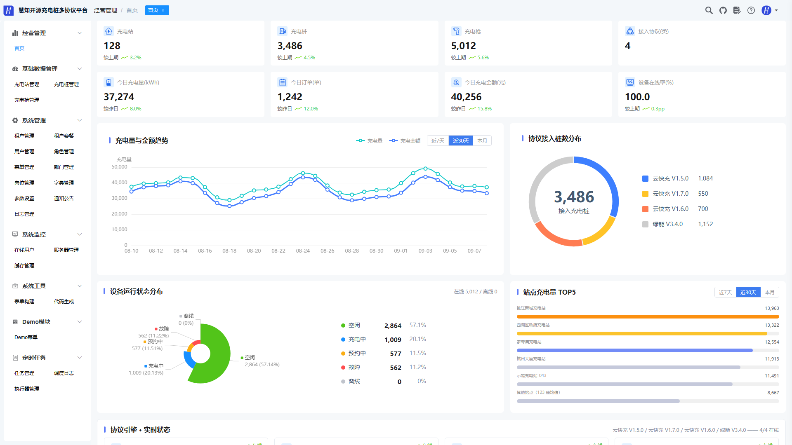
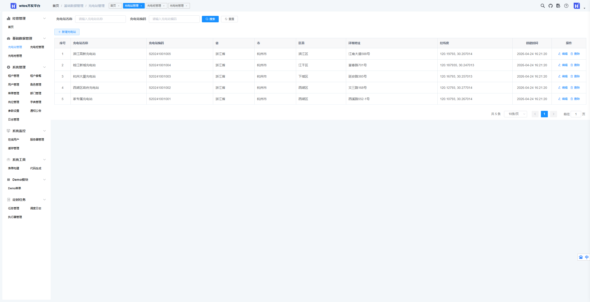
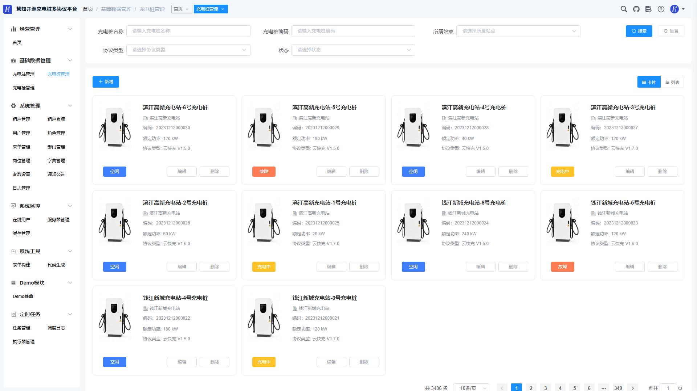
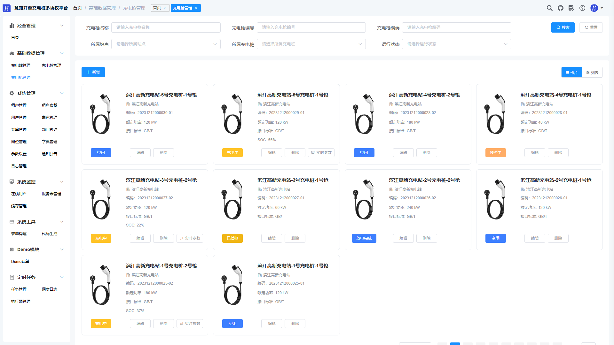
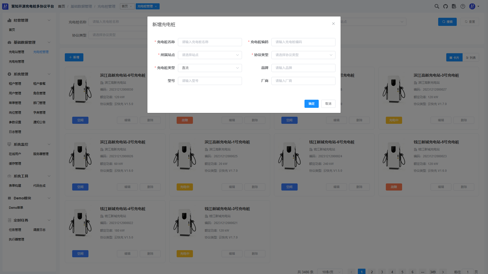

# 慧知开源云快充协议集成平台前端源码

当前版本：2.8.2（与后端 protocol-cloud 配套）

[🔥 慧知开源云快充协议集成平台前端源码](https://github.com/Roinli2561/protocol-admin)（当前）

[🔥 慧知开源云快充协议集成平台后端源码](https://github.com/Roinli2561/protocol-cloud)

[🔥 个人博客](https://wenhui.huizhidata.com)


<div align="center">

# 慧知开源云快充协议集成平台 · WEB 管理后台（Vue + Element UI）

</div>
<div align="center">
    <a href="https://github.com/Roinli2561/protocol-admin">
        
    </a>
    <a href="https://github.com/Roinli2561/protocol-admin">
        
    </a>
    <a href="https://github.com/Roinli2561/protocol-admin">
        
    </a>
</div>
<p align="center">
  <a href="http://platform.protocol.huizhidata.com">在线体验</a> | <a href="http://doc.protocol.huizhidata.com">帮助文档</a> | <a href="https://github.com/Roinli2561/protocol-admin">源码下载</a>
</p>
<p align="center">
  如果对您有帮助，您可以点右上角 "Star" ❤ 支持一下谢谢！
</p>

---

## 📖 项目介绍

慧知开源云快充协议集成平台前端（protocol-admin），是基于 AGPL-3.0 协议发布的开源充电桩多协议集成平台 WEB 管理后台，采用 Vue 2.6.12 + Element UI 2.15.14 开发，基于 RuoYi-Vue 二次开发，与后端 protocol-cloud（Spring Cloud Alibaba 微服务）前后端分离配套使用。

系统围绕充电桩运营场景，提供多协议设备管理、多租户 SaaS、系统管理、系统监控、定时任务、代码生成等一整套开箱即用的管理页面；菜单与按钮权限由后端动态下发、前端自动生成路由，为不同品牌、不同标准的充电桩提供统一管理界面，适用于充电桩运营企业、物业园区、新能源配套等场景。







### 技术架构

前端采用 Vue 单页应用（SPA）架构：Vuex 管理全局状态，Vue Router 依据后端菜单动态生成路由，axios 统一封装请求并携带 Token；Element UI 提供组件体系，ECharts 支撑数据可视化。通过 .env 多环境配置与 devServer 代理可快速对接本地、测试、生产网关，构建产物由 Nginx 托管并反向代理后端接口。

### 核心功能

#### 多协议接入页面
与后端多协议模块（multi-protocol）配套，内置充电站、充电桩、充电枪三级管理页面（/multi-protocol/stations、/multi-protocol/piles、/multi-protocol/guns），覆盖云快充 1.5、1.6、1.7 与绿能协议设备的统一接入、查询与维护。

#### 设备统一管理
面向充电站、充电桩、充电枪提供列表、详情、启停等 CRUD 操作页面，数据实时对接后端，支持协议自动适配场景下的统一管理界面，无需为不同协议分别维护页面。

#### 多租户 SaaS
内置租户管理、租户套餐管理页面，配合后端租户到期禁用与数据权限隔离，满足多租户平台化运营场景。

#### 系统运营能力
内置用户、角色、菜单、部门、岗位、字典、参数设置、通知公告、个人中心等系统管理页面，代码生成与在线构建器页面，操作日志、登录日志、在线用户、缓存监控、服务监控与定时任务等运维页面，开箱即用。

### 系统优势

#### 前后端分离、环境一键切换
开发、测试、生产环境通过 .env.development / .env.staging / .env.production 切换接口前缀；devServer 默认将 /dev-api 代理至本地网关 http://127.0.0.1:48080，将 /mp-api、/mp-ui 代理至多协议模块 http://127.0.0.1:8080，联调无需改动业务代码。

#### 动态菜单与按钮级权限
登录后按后端返回的菜单与权限码动态生成路由，配合 v-hasPermi 等指令实现按钮级权限控制，权限调整即时生效。

#### 组件化、易二开
业务页面、接口封装（src/api）、通用组件（分页、字典、上传、图片裁剪、富文本、Crontab、图标选择等）分层清晰；新增业务只需“后端接口 → src/api 封装 → 添加页面与菜单”三步即可完成。

#### 数据可视化
内置 ECharts 图表组件（折线、柱状、饼图、雷达等）与首页面板，便于充电量、金额等运营数据一屏掌握。

#### 工程化构建优化
基于 Vue CLI 4.4.6 构建，生产环境自动 gzip 压缩，并对 Element UI 与公共依赖拆包，部署简单、加载更快。

---

## 💻 技术特点

### 运行环境及框架
1. 前端框架：Vue 2.6.12 + Vue Router 3.4.9 + Vuex 3.6.0 + Element UI 2.15.14
2. 构建工具：Vue CLI 4.4.6（@vue/cli-service），样式预编译 sass 1.32.13
3. 网络请求：axios 0.24.0（统一封装，支持 Token 与错误拦截）
4. 数据可视化：ECharts 5.4.0
5. 运行条件：Node.js 8.9+、npm 3.0+；Windows / Linux 均可开发，兼容 Chrome、Edge、Firefox 等主流浏览器

### 项目框架及版本
```
1. Vue 2.6.12 + Element UI 2.15.14
2. Vue Router 3.4.9 / Vuex 3.6.0
3. axios 0.24.0
4. ECharts 5.4.0
5. quill 1.3.7（富文本编辑器）
6. Vue CLI 4.4.6 / sass 1.32.13
7. Node.js 8.9+ / npm 3.0+
```

### 项目代码目录介绍
1. `src/views`——页面层（首页、登录注册、多协议、系统管理、系统监控、定时任务、代码生成、在线构建器、演示等）
2. `src/api`——后端接口封装（system / monitor / tool / job / multiProtocol / demo）
3. `src/components`——通用组件（Pagination、DictTag、FileUpload、ImageUpload、Editor、Crontab、IconSelect 等）
4. `src/router`——路由配置（常量路由 + 动态路由）
5. `src/store`——Vuex 全局状态（用户、权限、字典、设置、多标签页等）
6. `src/layout`——主框架布局（侧边栏、顶栏、TagsView、设置等）
7. `src/directive`——自定义指令（v-hasPermi 权限、弹窗拖拽等）
8. `src/utils`——工具函数（request 封装、auth、缓存、下载、字典等）
9. `build`——构建与本地预览脚本
10. `public`——静态资源与页面入口（index.html）

---

## 🚀 快速开始

```bash
# 安装依赖
npm install

# 建议不要直接使用 cnpm 安装依赖，会有各种诡异的 bug。
# 可通过如下操作解决 npm 下载速度慢的问题
npm install --registry=https://registry.npm.taobao.org

# 启动开发服务（默认端口 80，自动打开浏览器）
npm run dev
```

浏览器访问 http://localhost:80

> 联调提示：默认接口前缀与代理见 .env.development 和 vue.config.js，开发环境将 /dev-api 代理至网关（http://127.0.0.1:48080），将 /mp-api、/mp-ui 代理至多协议模块（http://127.0.0.1:8080）。

## 📦 发布

```bash
# 构建测试环境
npm run build:stage

# 构建生产环境
npm run build:prod

# 本地预览构建产物
npm run preview
```

构建产物输出至 dist 目录，建议使用 Nginx 托管，并将 /prod-api（生产）或 /stage-api（测试）等接口前缀反向代理至后端网关。

## 环境变量说明

| 配置文件 | 用途 | VUE_APP_BASE_API |
| --- | --- | --- |
| .env.development | 本地开发 | /dev-api |
| .env.staging | 测试环境 | /stage-api |
| .env.production | 生产环境 | /prod-api |

VUE_APP_MP_API 为多协议模块接口前缀（默认 /mp-api），VUE_APP_TITLE 为页面标题（默认 witos开发平台）。

---

## 系统演示

管理后台：http://platform.protocol.huizhidata.com/

账号：admin      密码：admin123

---

## 📚 项目资料

### 资料支持
- 使用文档：http://doc.protocol.huizhidata.com/
- 接口文档：部署配套后端后在线查看 Swagger 接口文档
- 配套后端：[Roinli2561/protocol-cloud](https://github.com/Roinli2561/protocol-cloud)（Spring Cloud Alibaba 微服务，含多协议模块）
- 顶部导航内置帮助文档、博客与 GitHub 源码入口

### 功能页面一览

| 🔴 多协议接入 | 🟢 系统管理 | 🟡 多租户 SaaS | 🔵 系统监控 |
|------------|------------|------------|------------|
| 充电站管理 | 用户管理 | 租户管理 | 在线用户 |
| 充电桩管理 | 角色管理 | 租户套餐 | 缓存监控 |
| 充电枪管理 | 菜单管理 | 数据权限隔离 | 服务监控 |
| 首页面板 | 部门管理 | 到期禁用（后端） | 操作日志 |
| | 岗位管理 | | 登录日志 |
| | 字典管理 | | 定时任务管理 |
| | 参数设置 | | 调度日志 |
| | 通知公告 | | |
| | 个人中心 | | |

| 🟣 开发支持 | 🟤 平台能力 |
|------------|------------|
| 代码生成 | 动态路由 + 按钮级权限 |
| 在线构建器 | 多标签页 / 主题布局 |
| 演示页面 | 字典 / 上传 / 富文本组件 |
| 帮助文档 / 源码入口 | ECharts 数据可视化 |
| | gzip 压缩 + 依赖拆包 |

---

## 慧知开源技术交流

欢迎关注公众号，获取项目更新、部署资料与技术支持！


公众号 · 技术交流

您还可以通过以下方式联系我们：

- 邮箱：544061884@qq.com
- 微信：jinglidream

---

© 2026 huizhi-multi-protocol 版权所有  
开源协议：AGPL-3.0  
技术支持：544061884@qq.com